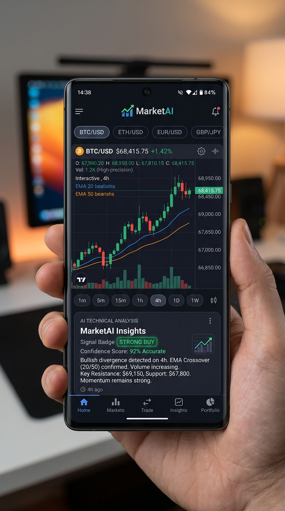

# MarketAI - Intelligent Technical Analyst & Trading Companion

<p align="center">
  
</p>

<p align="center">
  <a href="#fitur-utama"></a>
  <a href="#arsitektur--teknologi"></a>
  <a href="#ai-integration"></a>
  <a href="#market-data"></a>
</p>

---

## 📌 Deskripsi Singkat

**MarketAI** adalah aplikasi Android berbasis Kotlin & Jetpack Compose untuk analisis teknikal cerdas instrumen **Crypto, Forex, dan Komoditas**. Aplikasi ini mengintegrasikan data harga real-time berpresisi tinggi dengan analisis visual multimodal dari **Google Gemini**, menghadirkan pengalaman trading terminal modern di telapak tangan.

<p align="center">
  
</p>

---

## 🚀 Fitur Utama

### 📊 1. Kanvas Candlestick Interaktif & Presisi
- **Data Akurat Sesuai TradingView**: Sinkronisasi data OHLCV real-time melalui WebSocket dan REST feed.
- **Pinch-to-Zoom & Smooth Pan**: Navigasi riwayat candlestick dengan gestur sentuh multi-jari yang responsif, dilengkapi tombol zoom in/out dan tombol reset otomatis.
- **Mode Layar Penuh (Fullscreen)**: Tampilan visual chart penuh dengan kontrol indikator lengkap dan metrik HUD.
- **High-Precision OHLC HUD**: Menampilkan ringkasan Open, High, Low, Close, serta persentase perubahan harga secara rapi dan proporsional.
- **Crosshair Cerdas**: Inspeksi harga dan waktu candle secara mendetail cukup dengan ketukan atau sentuhan tahan pada layar.

### 📈 2. Indikator Teknikal Otomatis
- **Exponential Moving Average (EMA 9 & EMA 21)** untuk mengidentifikasi arah tren secara akurat.
- **Bollinger Bands (20, 2)** untuk mengukur volatilitas pasar dan area overextension.
- **Support & Resistance (S/R) & Pivot Points**: Garis otomatis level R1, S1, dan Pivot Point langsung pada kanvas chart.
- **Sub-Chart Modular**:
  - **RSI (Relative Strength Index 14)** dengan area Overbought (70) dan Oversold (30).
  - **MACD (12, 26, 9)** dengan histogram bullish/bearish visual.
  - **Stochastic Oscillator (%K, %D)** untuk deteksi titik jenuh beli dan jual secara presisi.
  - **ATR (Average True Range 14)** untuk kalkulasi volatilitas pasar real-time.
  - **Volume Bar** dengan pewarnaan dinamis sesuai volume buyer/seller.

### 🧠 3. Analisis Teknikal Berbasis AI (Gemini Multimodal Vision)
- Melakukan snapshot chart beresolusi tinggi langsung dari kanvas aplikasi.
- Menganalisis pola chart (misalnya *Head & Shoulders*, *Double Bottom*, *Bull Flag*), level Support & Resistance kunci, serta konfirmasi momentum indikator.
- Memberikan rekomendasi terstruktur: **BUY / SELL / HOLD**, estimasi *Entry*, *Take Profit*, *Stop Loss*, dan skor keyakinan (*Confidence Score*).

### 🔔 4. Notifikasi Sinyal & Price Alert
- Pengingat target harga (Price Above / Price Below).
- Notifikasi alert kondisi overbought/oversold RSI serta konfirmasi persilangan tren MACD.
- Notifikasi status langsung di perangkat saat target tercapai.

### ⚡ 5. Background Engine & UI Ringkas
- **Background Auto-Refresh**: Pembaruan harga dan candle berjalan otomatis di latar belakang tanpa elemen hitung mundur yang memadati antarmuka.
- **Timeframe Selector**: Pilihan timeframe fleksibel (1m, 5m, 15m, 1h, 4h, 1D).
- **Watchlist & Filter Kategori**: Navigasi cepat antara pasar Crypto, Forex, dan Komoditas.

---

## 🛠️ Arsitektur & Teknologi

- **Bahasa**: Kotlin (100%)
- **UI Framework**: Jetpack Compose dengan Material Design 3 (Dark Trading Terminal Theme)
- **Arsitektur**: MVVM (Model-View-ViewModel) dengan StateFlow & Coroutines
- **AI Engine**: Google Gemini API (Multimodal Vision Analysis)
- **Jaringan & WebSocket**: OkHttp3, Retrofit2, Kotlinx Serialization
- **Grafika & Kanvas**: Android Native Canvas & DrawScope Jetpack Compose

---

## 📂 Struktur Direktori Proyek

```text
app/src/main/java/com/example/
├── MainActivity.kt                      # Antarmuka utama dan koordinasi navigasi
├── data/
│   ├── calculator/
│   │   └── IndicatorCalculator.kt       # Perhitungan matematika EMA, RSI, MACD, Bollinger Bands
│   ├── fetcher/
│   │   ├── MarketDataFetcher.kt         # Orkes data pasar multi-sumber
│   │   └── XnoxsTradingViewFetcher.kt   # WebSocket & parser data candle TradingView
│   ├── gemini/
│   │   ├── ChartImageRenderer.kt        # Render bitmap chart untuk input AI multimodal
│   │   └── GeminiAnalystClient.kt       # Klien Gemini API untuk analisis visual
│   └── model/
│       └── MarketModels.kt              # Data model (CandleStick, MarketAsset, TechnicalIndicators, dll.)
├── service/
│   └── notification/
│       └── SignalNotificationManager.kt # Manajer notifikasi Android untuk alert & sinyal
└── ui/
    ├── MarketViewModel.kt               # State management & background ticker polling
    ├── components/
    │   ├── InteractiveCandlestickChart.kt # Kanvas chart, gesture pinch-zoom & dialog fullscreen
    │   ├── AiAnalysisCard.kt            # Kartu wawasan dan rekomendasi Gemini AI
    │   ├── AlertsDialog.kt              # Dialog pengaturan alarm harga & indikator
    │   ├── SymbolSearchDialog.kt        # Pencarian dan penambahan simbol pasar
    │   └── WatchlistBar.kt              # Navigasi cepat aset favorit
    └── theme/
        ├── Color.kt                     # Skema warna trading terminal (Cyan, Bull Green, Bear Red)
        ├── Theme.kt                     # Konfigurasi tema Material 3
        └── Type.kt                      # Tipografi
```

---

## ⚙️ Cara Menjalankan Proyek

### 1. Prasyarat
- Android Studio Ladybug / Koala atau versi lebih baru
- JDK 17 atau yang kompatibel
- Android SDK (API Level 26 ke atas)

### 2. Kloning Repositori
```bash
git clone https://github.com/developerxnoxs/dukun2.git
cd dukun2
```

### 3. Konfigurasi API Key Gemini
Tambahkan Gemini API Key Anda ke dalam file `.env` di root proyek:
```env
GEMINI_API_KEY="YOUR_GEMINI_API_KEY_HERE"
```

### 4. Build dan Jalankan
1. Buka proyek di Android Studio.
2. Sinkronkan Gradle (*Sync Project with Gradle Files*).
3. Jalankan aplikasi pada perangkat fisik Android atau Emulator:
```bash
./gradlew assembleDebug
```

---

## 📄 Lisensi
Didistribusikan di bawah lisensi MIT. Silakan gunakan, pelajari, dan kembangkan sesuai kebutuhan.
